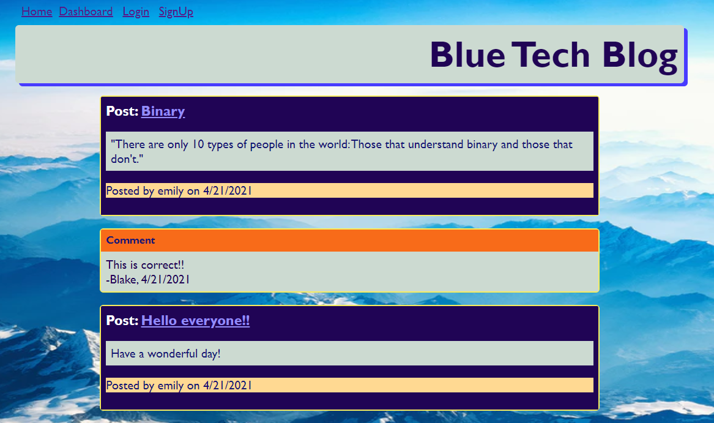
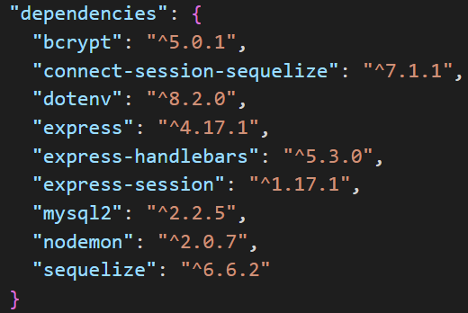
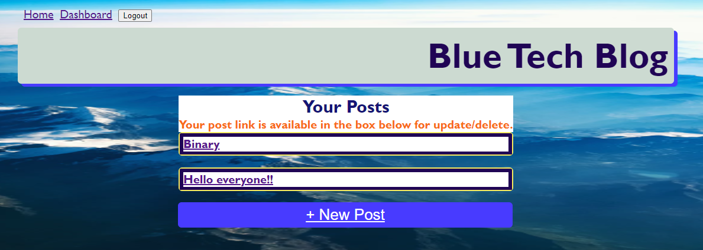
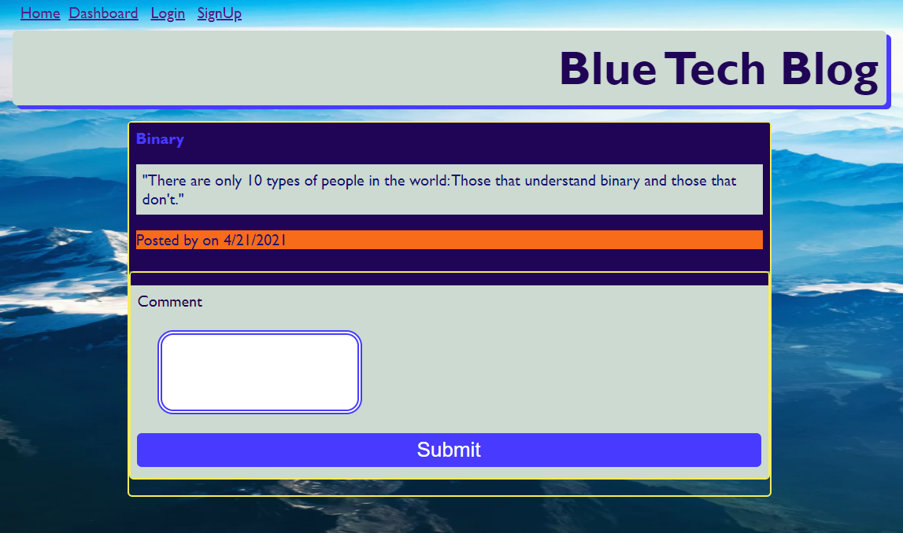
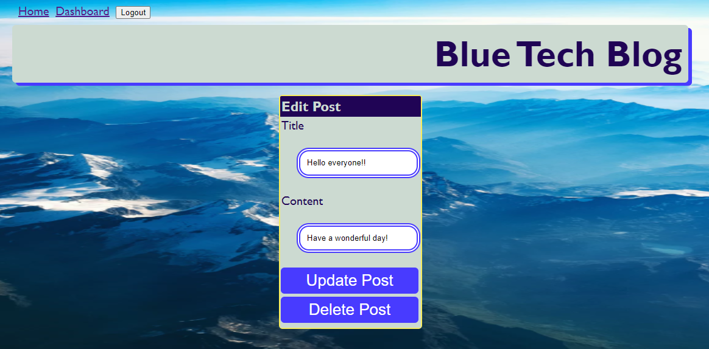

# BlueTechBlog

## Link to deployed website:
https://bluetechblog.herokuapp.com/

## Link to repo:
https://github.com/myrlaf25/BlueTechBlog

</img>

## Table of Contents

-[Description](#description)
-[Installation](#installation)
-[Usage](#usage)
-[Credits](#credits)
-[License](#license)
-[Tests](#tests)

# Description
This is a CMS-style blog site similar to Wordpress site, where developers can publish their blog posts and comment on other developers’ posts as well. This application was built from scratch and has been deployed in Heroku. The app follows the Model-View-Controller (MVC) paradigm, using Handlebars.js, Sequelize, and express-session npm package for authentication. 

</img>

# User Story
* AS A developer who writes about tech, I WANT a CMS-style blog site SO THAT I can publish articles, blog posts, and my thoughts and opinions.

## Business Context
The user will be able to read all posts and comments on the main homepage. The user may only post or comment if they signed up by creating a user account. Once the user is logged in, the user may create posts, leave comments on other posts, update/delete their posts. 

## Installation
The following are a list of packages the user will need to install to be able to run the application in localhost:

</img>

# Usage
When the user visits the site for the first time and presented with the homepage, which includes existing blogs, the user will also have navigation links to home, dashboard, option to login or signup. 

When the user clicks on the Home link, the user will be presented with the homepage. If the user clicks on any other links, the user will be redirected to login page. On the login page, if the user does not have an account, it gives the user the option to signup. 

When the user is presented with the signup page, the user must input the username, email, and password. The user credentials will be saved and is logged in. 

When the user visits the page at a later time and chooses to sign in, the user will have to enter the username, email, and password to sign in. The user will then be able to navigate the links for home, dashboard, and logout. 

</img>

When the user is logged in and clicks on the existing blog post which includes the title, content, creator's username, and date created, then the user is redirected to that post page and has the option to leave a comment. 

</img>

When the user clicks submit comment, the comment gets added at the bottom of that post and will display on the homepage with the comment, creator's username, and the date created. 

When the user is logged in and clicks on the dashboard link, the user is redirected to the dashboard and presented with any blog posts the user has created and the option to add a new blog post. 

When the user is logged in and clicks on the New Post option, the user then is prompted to enter both a title and contents for the blog post.

When the user is logged in and after creating a New Post, the post is saved and the user is redirected to the updated dashboard containing the new blog post. 

When the user is logged in and clicks on any existing posts on the dashboard, the user may update/delete such post. 

</img>

The user may click on the logout option in the navigation to sign out of the site. 

## Credits
I worked on this site mainly alone. I received assitance from a tutor, a teacher's assistant, and the Bootcamp Instructor. The most challenging part was deploying to Heroku. 

## License
For more information on the License, please click on the link: 
-[License] https://opensource.org/licenses/ISC

## Tests
Once the user enters the command in the terminal of nodemon server or node server.js, the user may utilize Insomnia Core to check the functionality. The API routes: This will provide CRUD functions that depending on what the user wants to do will GET, POST, PUT, or DELETE. 

-[GitHub] {https://github.com/myrlaf25}

##Questions
To contact me directly, please email me at: myrlaf25@gmail.com.